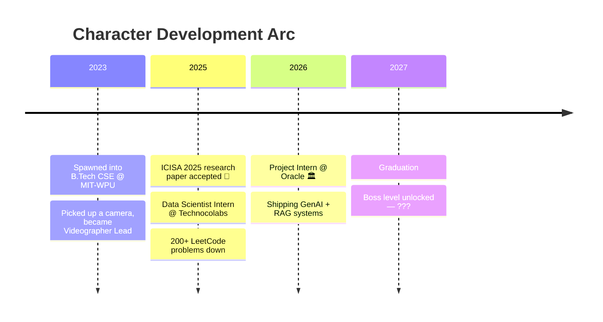

<div align="center">


<a href="https://github.com/ChachanNaman">

</a>


</div>

<br/>

```console
naman@earth:~$ whoami
> 3rd-year CS undergrad @ MIT-WPU, Pune (CGPA 8.41) — graduating 2027

naman@earth:~$ cat status.log
> [OK]  Oracle Financial Services — Project Intern (release automation, -70% manual work)
> [OK]  ICISA 2025 — research paper accepted (CNNs vs underwater trash. trash lost.)
> [OK]  Technocolabs — Data Science Intern (100k+ records, 3+ deployed ML models)
> [..]  Currently overclocking LLMs with RAG, reranking & prompt engineering

naman@earth:~$ sudo hire naman
> Permission granted. Scroll down for evidence.
```

> [!WARNING]
> Prolonged exposure to this profile may cause a sudden urge to open a pull request or a job offer. Proceed responsibly.

### 💬 Random Dev Quote


---

## ⚡ The Lore (rendered live by GitHub, no flaky widgets harmed)



---

## 🧪 Currently Brewing

| ☢️ Experiment | Status |
|---|---|
| **LLM Response Optimizer** — dual-LLM FastAPI chatbot (Groq + OpenRouter) | 🟢 sub-2s latency, ~40% fewer wrong answers via CrossEncoder reranking |
| **RAG & LangChain deep-dives** | 🟡 loading… `[████████░░] 80%` |
| **Competitive programming grind** | 🔁 infinite loop (intentional) |

---

## 🛠️ The Arsenal

<div align="center">


<br/><sub>+ LangChain · Pandas · NumPy · Seaborn · REST APIs · a suspicious amount of Matplotlib</sub>

</div>

---

## 🚀 Ship Log

| Vessel | Mission Report |
|---|---|
| 🤖 **LLM Response Optimizer** | FastAPI chatbot fusing **Groq + OpenRouter**. CrossEncoder reranking cut hallucinations ~40%, clarification logic boosted ambiguous-query accuracy ~25%. Answers fast, argues rarely. |
| 🌊 **Underwater Trash Detection** *(ICISA 2025)* | CNNs trained to spot garbage in the ocean. Data augmentation + hyperparameter tuning until the fish approved. **Published research.** |
| 💸 **Prepayment Risk Modeling** | Predicts early loan prepayments from **30,000+ records** — logistic regression & decision trees hitting **95.48% accuracy**. The bank's crystal ball, but with math. |
| 🗒️ **Notes Saver** | Node.js + Express REST API (8+ CRUD endpoints) with MongoDB and a React front-end. Your thoughts, but persistent. |
| 🍛 **Swiggy Clustering + Sentiment** | 5,000+ restaurant reviews → 20+ location clusters → actual business insights. Judging restaurants *scientifically*. |
| 🦜 **[LangChain Lab](https://github.com/ChachanNaman/LangChain)** | Hands-on notes & code: prompts, parsers, LCEL chains, runnables, loaders, splitters. My GenAI gym. |

---

## 📈 Numbers That Go Up

<div align="center">


<a href="https://leetcode.com/u/chachannaman/">

</a>


</div>

---

## 🐍 The Snake Ate My Commits

<div align="center">

<picture>
  <source media="(prefers-color-scheme: dark)" srcset="https://raw.githubusercontent.com/ChachanNaman/ChachanNaman/output/github-contribution-grid-snake-dark.svg"/>
  <source media="(prefers-color-scheme: light)" srcset="https://raw.githubusercontent.com/ChachanNaman/ChachanNaman/output/github-contribution-grid-snake.svg"/>
  
</picture>

</div>

---

<details>
<summary>🗝️ &nbsp;<b>CLASSIFIED — absolutely do NOT open this</b></summary>
<br/>

You opened it. Bold. I respect that. Here's your reward:

- 🎬 I lead videography for **MIT-WPU Shutterbugs** — 10+ major campus events scripted, shot, and edited. Yes, engineers can have aesthetics.
- 🧑‍🏫 Co-ran a competitive programming session for **20+ students** with CSI MIT-WPU. Teaching recursion is itself recursive.
- 🐛 My debugging strategy is 10% skill, 40% print statements, 50% staring intensely at the screen until the bug apologizes.
- 📈 `while(alive) { learn(); ship(); repeat(); }` — no base case, by design.

*This message will not self-destruct. It's markdown.*

</details>

---

<div align="center">

## 📡 Establish Contact

<a href="https://www.linkedin.com/in/naman-chachan-903bb9277/"></a>&nbsp;
<a href="mailto:chachannaman@gmail.com"></a>&nbsp;
<a href="https://leetcode.com/u/chachannaman/"></a>

<br/>

<sub>⭐ If something here made you smile, smash that follow button — it feeds the snake. 🐍</sub>


</div>

<!-- psst. recruiter reading raw markdown? that's exactly the attention to detail I'd bring to your team. email above. 😉 -->
